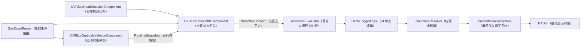
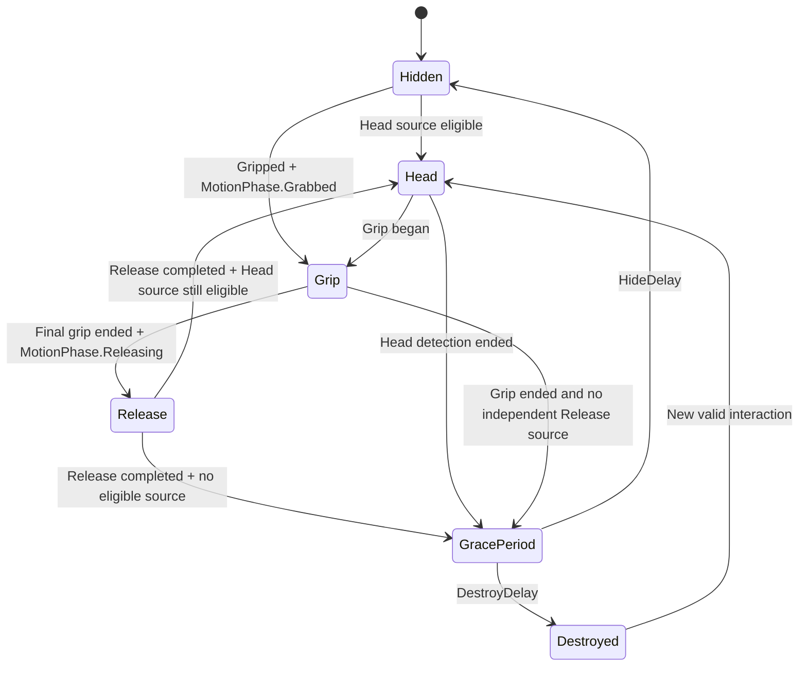
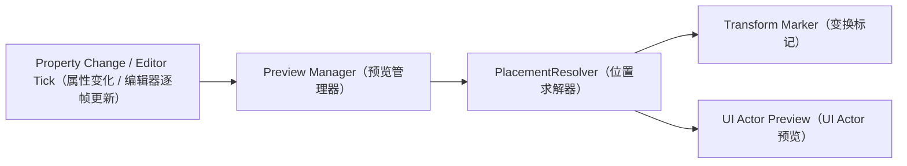

# Detectable Interaction 与 UI 架构

本文说明 `UVRExpDetectableComponent`、`UVRExpGrabbableMotionComponent` 和 `UVRExpDetectableUIInfoTriggerLogic` 的数据流、蓝图配置、释放策略及编辑器预览。

## 总体数据流



职责边界：

- `UVRExpGrabbableMotionComponent` 维护详细运动状态、抓取列表和释放运动。
- `UVRExpDetectableComponent` 聚合头部检测、抓取来源和可选运动快照。
- `UVRExpDetectableTriggerLogicBase` 统一处理基础来源开关的激活、停用和调试状态。
- `UVRExpDetectableUIInfoTriggerLogic` 只处理展示来源、Actor 生命周期、计时和优先级。
- `FVRExpUIInfoPlacementResolver` 是 Stateless（无状态）求解器，Runtime（运行时）和 Editor Preview（编辑器预览）共用。
- `UVRExpUIInfoPresentationSubsystem` 处理每个本地玩家的 Exclusive Priority（独占优先级）。

## HeadPrimitiveMode 怎么选

`HeadPrimitiveMode` 决定 Owner（所属 Actor）上哪些 `UPrimitiveComponent` 能被头部检测接受：

| 值 | 含义 | 推荐场景 |
|---|---|---|
| `OwnerAnyPrimitive` | Owner 上任意 Primitive（图元/碰撞组件）都可命中 | Actor 结构简单，任意网格或碰撞都代表同一交互物 |
| `OwnerRootPrimitive` | 只接受根组件，且根组件必须是 Primitive | 子组件很多，只允许整体根碰撞触发 |
| `AutoGripInterfacePrimitive` | 优先接受实现 `IVRGripInterface` 的 Primitive；没有时回退根 Primitive | 可抓取 Actor/组件结构，希望头部检测与抓取面一致 |
| `ExplicitPrimitives` | 只接受 `ExplicitPrimitives` 数组中的组件 | 需要精确控制检测区域；数组为空时不会被头部检测 |

默认推荐 `OwnerAnyPrimitive`。只有命中区域必须严格受控时再选 `ExplicitPrimitives`。

## MotionPhase 三阶段

`EVRExpGrabbableMotionPhase` 是从详细 `MotionState` 和 `ActiveGripCount` 推导出的稳定交互阶段，不测量物体到目标点的物理误差。

| 是否有运动组件 | `ActiveGripCount` | `MotionState` | `MotionPhase` |
|---|---:|---|---|
| 否 | 任意 | 任意 | `Unavailable` |
| 是 | `> 0` | 任意 | `Grabbed` |
| 是 | `0` | `Releasing` | `Releasing` |
| 是 | `0` | 其他任意状态 | `Normal` |

优先级固定为 `Grabbed > Releasing > Normal`。因此即使详细状态短暂仍为 `Releasing`，只要存在有效抓取，粗粒度阶段就是 `Grabbed`。

`ReturnToOrigin` 完成后，详细状态退出 `Releasing`，粗粒度阶段自然回到 `Normal`。

## 可选运动组件与抓取来源

`GripSourceMode=Auto` 时无需暴露或填写 `GrabbableMotionSource`：

| 有效运动组件数 | Owner/组件实现 `IVRGripInterface` | `ResolvedGripSource` | 行为 |
|---:|---|---|---|
| 1 | 任意 | `GrabbableMotionComponent` | 使用统一运动快照和该组件的抓取路由 |
| 0 | 是 | `DetectableTargets` | 直接监听可抓取 Owner/组件 |
| 0 | 否 | `None` | 不注册空抓取路由；头部检测继续工作 |
| >1 | 任意 | `None` | 视为歧义并报警，不随机选择 |

手动选择 `GrabbableMotionComponent` 时，`GrabbableMotionSource` 才在 Details Panel（细节面板）中显示。多个运动组件必须切换到该模式并明确指定。

## Release UI 状态机

展示来源优先级固定：

```text
Grip > Release > HeadDetection > Motion
```



`EVRExpUIInfoReleaseBehavior`：

| 值 | 行为 |
|---|---|
| `DeferToCurrentInteraction` | 兼容旧逻辑；不建立独立 Release 来源，直接回到 Head 或 Motion |
| `HideDuringRelease` | 释放阶段隐藏 UI Actor，但保留实例，不启动销毁计时 |
| `KeepGripPresentation` | `InteractionSource=Release`，继续使用 `GripPresentationSettings` |
| `UseReleasePresentation` | `InteractionSource=Release`，使用独立 `ReleasePresentationSettings` |

UI Actor 不增加专用释放回调。已有 `OnUIInfoPresentationChanged` 会收到 `InteractionSource=Release`。

Release 的本地玩家解析顺序：

1. 当前缓存的本地玩家；
2. 上一次释放对应的本地玩家；
3. 当前释放快照中的 `GripController`；
4. 当前头部检测玩家；
5. `MotionLocalPlayerIndex`。

## 目标蓝图配置

以下配置适用于基于 `AGrippableStaticMeshActor` 的对象。

### 1. 组件

- 添加 `UVRExpGrabbableMotionComponent`。
- 添加 `UVRExpDetectableComponent`。
- 设置 `NormalMotionMode=None`。
- 设置 `ReleaseMotionMode=ReturnToOrigin`。
- 设置 `GripSourceMode=Auto`。
- 不填写 `GrabbableMotionSource`。

### 2. Source Switches（来源开关）

新建 `VRExpDetectableUIInfoTriggerLogic` 默认使用以下简单配置：

- `Activate On Head Detection=true`
- `Head Only In Normal Phase=true`
- `Activate While Gripped=true`
- `Enable Motion-Only Presentation=false`

含义：

- 有运动组件时，Head（头部来源）只在 `MotionPhase.Normal` 激活。
- 没有运动组件时，Head 不会被阶段条件误伤。
- Direct Grip（直接抓取）和 Motion Component Grip（运动组件抓取）都能激活 Grip 来源。
- Release（释放来源）不需要单独搭规则，由 `ReleaseBehavior` 自动决定。
- `Enable Motion-Only Presentation` 只在确实需要“没有 Head/Grip 也展示”时开启。

来源优先级始终是：

```text
Grip > Release > HeadDetection > Motion
```

蓝图需要访问具体逻辑时，调用 `UVRExpDetectableComponent.GetTriggerLogicByClass`，将 `TriggerLogicClass` 设置为目标类型。节点输出类型会随输入类变化；获取 `UVRExpDetectableUIInfoTriggerLogic` 后可继续调用 `GetSpawnedUIActor`。

### 3. 展示位置

`HeadPresentationSettings`：

- `AnchorType=World`
- `WorldTransform` 设置为设计好的固定世界变换
- `BindingMode=ResolveOnce`（World 会自动规范为该模式）

`GripPresentationSettings`：

- `AnchorType=Camera`
- `BindingMode=Follow`
- 通过 `RelativeOffset` 设置相机前方偏移

`ReleaseBehavior`：

- 当前需求设置为 `UseReleasePresentation`

`ReleasePresentationSettings`：

- 独立设置 `AnchorType`、`BindingMode`、`RelativeOffset`/`WorldTransform`
- 可独立设置位置、旋转、缩放平滑和 `Priority`

释放完成后会重新执行来源判断：仍被头部检测且 Head 来源符合阶段要求时回到固定世界位置；否则进入 `GracePeriod` 及现有隐藏/销毁计时。

## ReturnToOrigin 与 ReturnToStart

- `ReturnToOrigin`：只把位置恢复到运动原点；不恢复旋转。
- `ReturnToStart`：恢复 `BeginPlay` 时捕获的完整 Transform（变换），包含位置、旋转和缩放。

如果需求是“只回到原地但保留释放后的朝向”，使用 `ReturnToOrigin`。如果必须完全还原摆放姿态，使用 `ReturnToStart`。

## 编辑器预览

Editor Preview Manager（编辑器预览管理器）是独立的 Tickable Editor Object（可逐帧更新的编辑器对象）。它扫描 `Editor`、`EditorPreview` 和 `Inactive` 世界中的有效 `UVRExpDetectableComponent`，因此预览是否显示与 Actor 或组件是否被选中无关；多个启用对象可以同时显示。



每个 `VRExpDetectableUIInfoTriggerLogic` 可设置：

- `EditorPreviewMode=Disabled`：默认，无编辑器副作用。
- `EditorPreviewMode=TransformMarker`：绘制坐标轴、线框边界和来源标签。
- `EditorPreviewMode=UIActor`：生成临时 `UChildActorComponent` 并显示实际 UI Actor。
- `EditorPreviewSource=Head/Grip/Release/Motion`：一次只预览一个来源。

两种模式均调用 `FVRExpUIInfoPlacementResolver`，所以固定世界位置、相机跟随偏移、Between（两点之间）位置和朝向算法与运行时一致。

### World Editor Preview 视口编辑

当所选 `EditorPreviewSource` 的展示设置满足以下条件时，可以直接在 Blueprint Editor（蓝图编辑器）或 Level Editor（关卡编辑器）视口中编辑 World Transform（世界变换）：

```text
EditorPreviewMode=UIActor 或 TransformMarker
AnchorType=World
PositionMode=AnchorRelative
```

使用 `EditorPreviewMode=UIActor` 时，还需要为 `UIActorClass` 配置有效的 UI Actor 类。

使用步骤：

1. Blueprint Editor（蓝图编辑器）中必须在 Components（组件）树选中 `UVRExpDetectableComponent`。
2. Level Editor（关卡编辑器）中可以直接点击预览 UI / Transform Marker 本体；它会选择所属 Actor，并在下一帧激活对应的 Component Visualizer（组件可视化器）。也可以先在 World Outliner（世界大纲）中选择所属 Actor。
3. 点击青色控制点或青色包围盒轮廓也可以显式激活预览编辑。
4. 使用标准平移、旋转和缩放 Gizmo（变换手柄）调整预览。
5. 变换直接写回当前 `EditorPreviewSource` 对应的 `PresentationSettings`，支持 Undo/Redo（撤销/重做）。

未激活时，可点击区域显示为青色轮廓，Hit Testing（命中测试）使用整个包围盒，因此不再要求精确点击原点。激活编辑后轮廓变为黄色，并立即取消该包围盒的 Hit Proxy（点击命中代理）；黄色框此时仅用于显示编辑范围，鼠标输入由标准 Gizmo（变换手柄）独占，避免出现“手柄可见但无法拖动”。

黄色/青色交互框可在 Project Settings（项目设置）→ Plugins（插件）→ `VRExpansion Extensions - Editor Preview` → `UI Info Preview | Interaction Bounds` 中调整：

| 配置 | 作用 |
|---|---|
| `Draw Interaction Bounds` | 只控制是否绘制线框；关闭后配置的点击区域仍然有效 |
| `Bounds Mode=Auto From UI Actor` | 使用 UI Actor 自动包围盒 |
| `Auto Bounds Scale` | 按 X/Y/Z 缩放自动包围盒，只影响编辑器交互框 |
| `Bounds Mode=Fixed Size` | 使用独立的固定尺寸，不读取 UI Actor 大小 |
| `Fixed Bounds Size (cm)` | 设置交互框完整 X/Y/Z 尺寸，单位为厘米 |
| `Bounds Padding (cm)` | 在交互框每一侧增加额外边距 |

这些字段只修改 Component Visualizer（组件可视化器）的绘制范围，以及未激活编辑时的 Hit Testing（命中测试）范围，不会修改 `UIActor`、`WorldTransform.Scale`、碰撞或运行时表现。设置修改后会立即重绘编辑器视口。

`VRExpansionExtensionsEditor` 使用 `PostEngineInit`（引擎初始化后）加载并注册可视化器。修改或重新编译该模块后需要完整重启 Editor，不能只依赖 Live Coding（实时编码）。启动成功时 Output Log（输出日志）会出现：

```text
LogVRExpansionExtensionsEditor: Display: UI Info component visualizer registration: Succeeded
```

字段映射：

| 视口操作 | 写回字段 |
|---|---|
| 平移 | `WorldTransform.Location` |
| 缩放 | `WorldTransform.Scale` |
| `OrientationMode=InheritAnchor` 时旋转 | `WorldTransform.Rotation` |
| `OrientationMode=FixedWorld` 时旋转 | `FixedWorldRotation` |

安全限制：

- `FaceCamera` 和 `FaceCameraYawOnly` 的旋转由相机朝向算法生成，视口中只允许平移和缩放；旋转继续通过朝向轴和 `FacingRotationOffset` 配置。
- `PositionMode=BetweenAnchorAndCamera` 的最终位置依赖锚点、相机和距离钳制，不能直接反写为唯一的 `WorldTransform`，因此显示为只读。
- 多个 UI Trigger Logic 时，视口编辑与预览规则一致，只处理第一个启用预览的逻辑。
- Blueprint Editor 中写回组件 Archetype（原型）；已有实例单独覆盖的变换分量不会被默认值传播覆盖。
- Level Editor 中写回当前 Actor 实例。
- Level Editor 中临时 UI Actor 和 Transform Marker 的图元允许参与 Hit Testing（命中测试），但 Child Actor（子 Actor）的选择会规范到拥有 `UVRExpDetectableComponent` 的父 Actor；随后自动激活预览 Component Visualizer，不会把 Gizmo 绑定到临时 Actor。
- Component Visualizer 使用自身是否已产生配置变化来结束拖动事务，避免 Level Editor 报告 `bDidMove=false` 时丢失最终 `ValueSet` 通知和 Undo/Redo（撤销/重做）记录。
- 预览 `UChildActorComponent` 和 Child Actor 仍是 `Transient + EditorOnly`；变换手柄修改的是配置，临时对象不会保存到资产、关卡或打包内容。

Camera（相机）来源会匹配对象所属 World（世界）的编辑器视口，移动视口时逐帧更新。求解失败不会再静默不显示：对象原点会出现红色错误标记，并在细节面板提供 `EditorPreviewStatus` 和 `EditorPreviewFailureReason`。

| `EditorPreviewStatus` | 含义 |
|---|---|
| `Disabled` | 未启用或预览已清理 |
| `Active` | 变换标记或 UI Actor 正常显示 |
| `MissingUIActorClass` | `UIActor` 模式未配置类 |
| `NoMatchingViewport` | 当前设置需要 Camera，但找不到同 World 的编辑器视口 |
| `AmbiguousMotionSource` | Motion 锚点对应多个运动组件，无法唯一解析 |
| `PlacementFailed` | 锚点或位置/朝向求解失败 |

安全限制：

- 只有显式选择 `UIActor` 模式才设置 `UIActorClass` 并执行 Blueprint Construction Script（蓝图构造脚本）。
- 临时组件和 Actor 使用 `Transient + EditorOnly`，不加入保存数据。
- 禁用碰撞、Tick（逐帧更新）、Replication（网络复制）和游戏内可见性。
- 属性变化会原地刷新；蓝图预编译、组件注销、World Cleanup（世界清理）、进入 PIE、切换地图及编辑器模块卸载时销毁临时对象。
- 退出 PIE 后自动重新扫描并恢复所有仍启用的预览。
- Camera Attach（相机附着）在编辑器视口没有真实 Camera Component（相机组件），预览时按 Follow 计算变换；运行时仍按实际 Attach 行为。
- 一个 `UVRExpDetectableComponent` 有多个 UI Trigger Logic 时，视口预览使用第一个未禁用预览的逻辑，避免生成重叠的实际 Actor。

## 兼容性

- 现有五值 `EVRExpGrabbableMotionState` 数值不变。
- `EVRExpUIInfoInteractionSource::Release` 追加在枚举末尾。
- `ActivationMode`、`AdvancedRuleSet`、高级规则类型和相关调试字段已删除；这是 Breaking Change（破坏性接口变更）。
- 基础 Head、Grip、Release 和 Motion 来源开关是唯一激活路径。
- 旧资产中保存的基础来源开关继续生效；自定义高级规则不再迁移或执行。
- 展示设置和 UI Actor Interface（界面 Actor 接口）保持不变。
- `ReleaseBehavior` 默认 `DeferToCurrentInteraction`。
- `EditorPreviewMode` 默认 `Disabled`。

## 验证

自动测试路径：

```text
VRExpansionExtensions.Detection.MotionPhase.Derivation
VRExpansionExtensions.Detection.GripSource.AutomaticResolution
VRExpansionExtensions.Detection.TriggerLogic.GetByClass
VRExpansionExtensions.UI.Activation.SourceSwitches
VRExpansionExtensions.UI.Placement.SharedResolver
VRExpansionExtensions.UI.Release.SourcePriority
VRExpansionExtensions.Editor.UIInfo.PreviewManager
```

手动验证检查点：

1. 无运动组件、无 `IVRGripInterface`：`ResolvedGripSource=None`，头部检测仍能触发。
2. 无运动组件、有直接抓取接口：可直接抓取；启用 Motion-only 时必须存在有效运动组件。
3. `Grip -> Release -> Head`：来源按顺序切换，最终回到固定世界位置。
4. `Grip -> Release -> GracePeriod`：无头部检测时按 Hide/Destroy 延时处理。
5. 四种 `ReleaseBehavior` 分别验证可见性、位置和接口收到的来源。
6. 不选中 Actor/组件，在 Blueprint Editor（蓝图编辑器）和 Level Editor（关卡编辑器）确认多个对象的两种预览仍同时显示。
7. 故意清空 `UIActorClass` 或配置歧义 Motion 锚点，确认红色错误标记、状态和失败原因同时出现。
8. 进入 PIE 前确认预览对象已销毁，退出 PIE 后确认自动恢复；打包内容中不得出现预览 Child Actor。

构建验证应依次覆盖 Win64 Editor、UHT 和 Android 模块边界，但必须先取得项目维护者明确确认。
