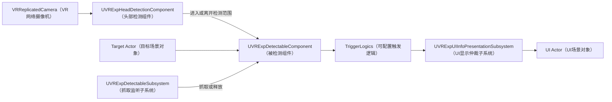
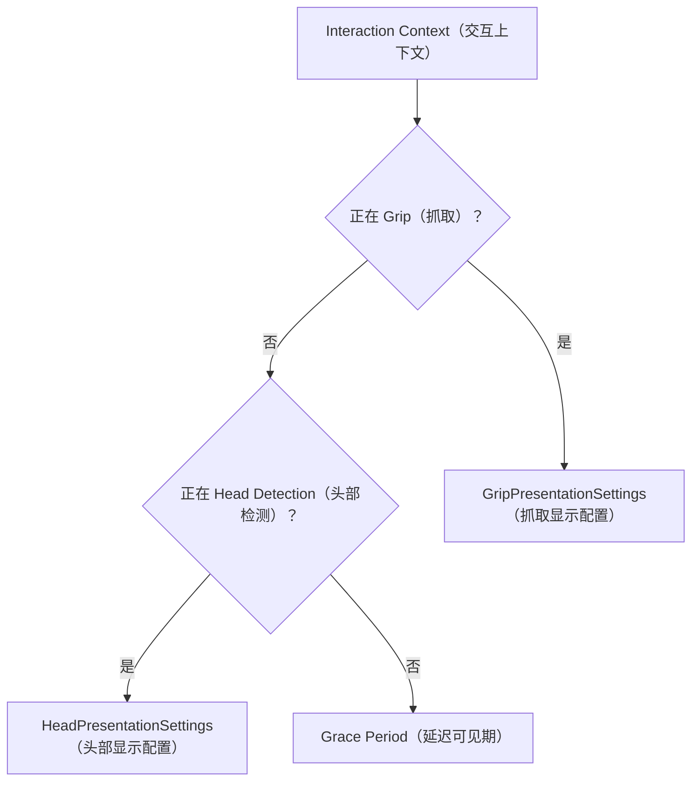

# VRExpansionExtensions 头部检测与被检测组件使用说明

本文档说明如何在 Blueprint（蓝图）中使用：

- `UVRExpHeadDetectionComponent`
- `UVRExpDetectableComponent`
- `UVRExpDetectableTriggerLogicBase`
- `UVRExpDetectableSubsystem`
- `UVRExpDetectableUIInfoTriggerLogic`
- `UVRExpUIInfoPresentationSubsystem`
- `UVRExpUIInfoActorInterface`

本文档对应当前 `VRExpansionExtensions` 源码。组件需要由使用者手动添加到蓝图，不会自动修改现有蓝图资产。

## 1. 术语对照

| English Term（英文术语） | 中文含义 |
|---|---|
| Blueprint | 蓝图 |
| Component | 组件 |
| Actor | 场景对象 |
| Pawn | 玩家或角色控制对象 |
| Interface | 接口 |
| Grip | 抓取 |
| Trigger Logic | 触发逻辑 |
| Delegate | 委托事件 |
| Context | 交互上下文 |
| Overlap | 范围重叠查询 |
| Trace | 射线或碰撞追踪 |
| Object Type | 碰撞对象类型 |
| Line of Sight | 可见性视线 |
| World Subsystem | 世界级子系统 |
| PIE | 在编辑器中运行游戏 |
| Query Collision | 查询碰撞 |
| Local Controlled | 本地控制 |

## 2. 系统关系



职责划分：

- `UVRExpHeadDetectionComponent`：从摄像机位置执行头部查询。
- `UVRExpDetectableComponent`：保存头部、抓取和汇总交互状态。
- `UVRExpDetectableSubsystem`：自动监听世界中的抓取控制器，不需要手动添加。
- `UVRExpDetectableTriggerLogicBase`：根据状态组合控制具体行为的激活和结束。
- `UVRExpDetectableUIInfoTriggerLogic`：生成并管理每个目标自己的 UI Actor。
- `UVRExpUIInfoPresentationSubsystem`：统一更新 UI 平滑并仲裁相机 UI 优先级。

## 3. 最快接入：只做头部检测

### 3.1 在 VR Pawn 中添加检测器

1. 打开包含 `VRReplicatedCamera` 的 VR Pawn 蓝图。
2. 点击 `Add Component`。
3. 搜索并添加 `VRExp Head Detection Component`。
4. 将它拖到 `VRReplicatedCamera` 下，成为摄像机的子组件。
5. 将 Relative Location（相对位置）和 Relative Rotation（相对旋转）设为零。
6. 首次测试保持以下默认值：

   - `bDetectionEnabled = true`
   - `DetectionMode = ForwardRay`
   - `TargetMode = SingleClosest`
   - `bOnlyRunForLocallyControlledPawn = true`
   - `DetectionInterval = 0.05`
   - `RayDistance = 100`
   - `RayTraceChannel = Visibility`
   - `DetectionObjectTypes = WorldDynamic, PhysicsBody`

组件的位置就是检测起点，组件的前向 X 轴就是射线和锥体方向。

### 3.2 在目标 Actor 中添加被检测组件

1. 打开需要被头部检测的 Actor 蓝图。
2. 点击 `Add Component`。
3. 搜索并添加 `VRExp Detectable Component`。
4. 第一次测试设置：

   - `PrimitiveMode = OwnerAnyPrimitive`
   - 如果不需要抓取检测，可以设置 `bEnableGripDetection = false`

5. 确认目标 Actor 中至少有一个 `UPrimitiveComponent`，例如：

   - `StaticMeshComponent`
   - `SkeletalMeshComponent`
   - `BoxComponent`
   - `SphereComponent`
   - `CapsuleComponent`

6. 确认该碰撞组件：

   - `Collision Enabled` 至少包含 `Query`
   - `Object Type` 是检测器 `DetectionObjectTypes` 数组中的类型

### 3.3 绑定蓝图事件

选中目标 Actor 中的 `VRExp Detectable Component`，在 Details（细节）面板中添加：

- `On Head Detection Started`
- `On Head Detection Ended`
- `On Interaction State Changed`

事件会提供 `FVRExpDetectableInteractionContext`。可以在蓝图中拆分这个结构，读取：

- `bIsHeadDetected`
- `bIsGripped`
- `bIsInteracting`
- `ChangeSource`
- `ChangePhase`
- `HeadDetector`
- `DetectedPrimitive`
- `GripController`
- `GripInformation`

也可以直接调用：

- `IsHeadDetected`
- `IsGripped`
- `IsInteracting`

### 3.4 打开调试显示

在头部检测组件中设置 `Draw Runtime Debug`：

```text
bDrawDebug = true
```

该开关只在 PIE（编辑器运行）或 Game（游戏）中绘制，不会在蓝图预览窗口里画线。
运行时会在世界中绘制检测形状和小型线框命中标记，并通过固定 Key（固定消息标识）
在屏幕左上角刷新一份白色汇总信息，不会在目标位置重复堆叠整段文字。颜色含义：

- 红色：查询没有命中任何碰撞。
- 橙色：命中了碰撞，但 Object Type（对象类型）、`UVRExpDetectableComponent`
  或 Primitive Mode（碰撞目标模式）过滤未通过。
- 绿色：最终选中了一个有效目标。
- 青色：最终选中了多个有效目标。

调试文字包含：

```text
Raw Hits      原始 Trace / Overlap 命中数
Valid         Single / Multiple 策略执行前的有效目标数
Selected      最终通知的目标数
Raw Hit       最近原始命中的 Actor / Primitive
Selected      最终选中的 Actor / Primitive
```

组件还暴露只读运行时属性：

- `LastDebugState`
- `LastQueryHitCount`
- `LastValidTargetCount`
- `LastSelectedTargetCount`
- `LastQueryHitActor` / `LastQueryHitPrimitive`
- `LastQueryHitRejectionReason`
- `LastRejectionSummary`
- `LastSelectedActor` / `LastSelectedPrimitive`

`Draw World Target Labels` 默认关闭。需要在世界物体旁标记名称时再开启；同一个 Primitive（碰撞组件）
同时是原始命中和最终目标时，会合并为一条 `Raw + Selected` 标签。可以通过
`Debug Screen Text Scale` 调整屏幕汇总文字大小。

这些属性是 `VisibleInstanceOnly`（仅实例可见）：在 PIE 中选中实际生成的 Pawn 及其检测组件查看，
或在蓝图中直接读取；蓝图 Class Defaults（类默认值）不会显示实时结果。

这样可以区分“射线没有碰到任何东西”“碰到了错误碰撞”“碰到了正确碰撞但没有被检测组件”
和“已经选中正确目标”。

如果显示橙色，直接查看 `Nearest rejection`：

- `ObjectType WorldStatic is not enabled`：把 `WorldStatic` 加入 `DetectionObjectTypes`，
  或把目标碰撞的 Object Type 改为已经启用的类型。
- `has no UVRExpDetectableComponent`：原始命中的 Actor 没有被检测组件。
- `rejected by PrimitiveMode`：被检测组件存在，但当前 Primitive Mode 不接受实际命中的组件。
- `outside the configured forward cone`：对象在锥体 Broad Phase（宽阶段查询）内，但不在实际角度范围内。
- `cone line of sight is blocked`：Line of Sight（视线）被其他碰撞阻挡。

### 3.5 单目标和多目标

`TargetMode` 控制最终检测数量：

| TargetMode | 行为 |
|---|---|
| `SingleClosest` | 默认值，只保留最近的一个有效 `UVRExpDetectableComponent` |
| `Multiple` | 保留当前查询找到的全部有效目标 |

射线使用 `Multiple` 时会处理 `LineTraceMulti`（多命中射线查询）返回的全部结果，但射线仍会在第一个
Blocking Hit（阻挡命中）处停止，无法检测该阻挡物后方的对象。

Details（细节）面板只显示当前 `DetectionMode` 对应的参数：

- `SphereOverlap` 只显示 `SphereRadius`。
- `ForwardRay` 只显示 `RayDistance` 和 `RayTraceChannel`。
- `ForwardCone` 只显示锥体参数；关闭 Line of Sight 后会隐藏对应 Channel。
- 内部使用的 `ComponentTick` 设置不再暴露，查询频率统一使用 `DetectionInterval`。

## 4. 三种头部检测模式

### 4.1 SphereOverlap

以检测组件位置为中心执行球体范围查询。

特点：

- `SingleClosest` 返回范围内最近的有效目标，`Multiple` 返回范围内全部有效目标。
- 适合头部靠近、穿入或接触物体的检测。
- 默认半径为 `20 cm`。
- 不依赖 `Visibility` 通道。

关键配置：

```text
DetectionMode = SphereOverlap
TargetMode = SingleClosest 或 Multiple
SphereRadius = 20
DetectionObjectTypes = WorldDynamic, PhysicsBody
```

### 4.2 ForwardRay

沿检测组件前向 X 轴执行射线查询。

特点：

- `SingleClosest` 保留射线上最近的有效目标。
- `Multiple` 保留射线查询返回的全部有效目标。
- 适合注视、头部朝向选择或准星式检测。
- 默认距离为 `100 cm`。
- 目标碰撞组件必须响应 `RayTraceChannel`。
- 即使目标被射线命中，其 `Object Type` 仍必须在 `DetectionObjectTypes` 中。

关键配置：

```text
DetectionMode = ForwardRay
TargetMode = SingleClosest
RayDistance = 100
RayTraceChannel = Visibility
```

推荐目标碰撞配置：

```text
Collision Enabled = Query Only 或 Query And Physics
Object Type = WorldDynamic 或 PhysicsBody
Visibility = Block
```

### 4.3 ForwardCone

先执行球形宽阶段查询，再进行距离、角度和可见性过滤。

特点：

- `SingleClosest` 返回锥体内最近的有效目标，`Multiple` 返回锥体内全部有效目标。
- 默认距离为 `150 cm`。
- 默认半角为 `30°`。
- 默认要求 `Visibility` 视线通过。

关键配置：

```text
DetectionMode = ForwardCone
TargetMode = SingleClosest 或 Multiple
ConeDistance = 150
ConeHalfAngleDegrees = 30
bConeRequiresLineOfSight = true
ConeLineOfSightChannel = Visibility
```

如果锥体检测可以穿墙：

1. 检查 `bConeRequiresLineOfSight` 是否开启。
2. 检查墙体是否对 `Visibility` 设置为 `Block`。
3. 检查墙体是否启用了查询碰撞。

## 5. PrimitiveMode 的选择

`PrimitiveMode` 决定目标 Actor 中哪些碰撞组件可以代表这个被检测对象。

### 5.1 OwnerAnyPrimitive

默认模式。

目标 Actor 中任意 `UPrimitiveComponent` 被检测到，都算该对象被检测。

适合：

- 简单静态网格物体。
- Actor 中多个碰撞区域都有效。
- 首次接入和快速验证。

### 5.2 OwnerRootPrimitive

只接受 Actor 的 Root Component（根组件），并且根组件必须继承 `UPrimitiveComponent`。

适合：

- 只想让根碰撞代表整个对象。
- 子碰撞只用于其他用途，不应触发头部检测。

注意：如果根组件是普通 `SceneComponent`，这个模式不会命中。

### 5.3 AutoGripInterfacePrimitive

自动寻找实现 `IVRGripInterface` 的碰撞组件。

规则：

1. 如果 Actor 中存在实现 `IVRGripInterface` 的 `UPrimitiveComponent`，只接受这些组件。
2. 如果没有找到接口碰撞组件，则回退到 Root Primitive（根碰撞组件）。

这个回退保证没有抓取接口的对象仍然可以做纯头部检测。

适合：

- `GrippableStaticMeshComponent`
- `GrippableSkeletalMeshComponent`
- 一个 Actor 中存在多个可独立抓取组件

### 5.4 ExplicitPrimitives

只接受 `ExplicitPrimitives` 数组中明确配置的碰撞组件。

适合：

- Actor 中只有指定碰撞区可以被头部检测。
- 需要排除装饰网格、辅助碰撞和其他子组件。

如果数组为空：

- 不会产生头部检测。
- 日志只输出一次 Warning（警告）。

## 6. 开启抓取联动

### 6.1 Actor 自己实现抓取接口

如果目标 Actor 自己实现 `IVRGripInterface`：

1. 添加 `UVRExpDetectableComponent`。
2. 保持 `bEnableGripDetection = true`。
3. 不需要手动绑定抓取控制器。

### 6.2 Actor 内组件实现抓取接口

如果 Actor 自己没有接口，但内部组件实现 `IVRGripInterface`：

1. 添加 `UVRExpDetectableComponent`。
2. 保持 `bEnableGripDetection = true`。
3. 子系统会自动注册所有实现接口的组件。

### 6.3 没有抓取接口

如果 Actor 和内部组件都没有 `IVRGripInterface`：

- 不会注册任何抓取目标。
- 不会输出错误。
- 头部检测仍然正常工作。

如果明确只需要头部检测，建议关闭：

```text
bEnableGripDetection = false
```

### 6.4 抓取事件和状态

可以绑定：

- `On Grip Started`
- `On Grip Ended`
- `On Interaction State Changed`

状态关系：

```text
bIsInteracting = bIsHeadDetected || bIsGripped
```

组件内部使用集合记录多个检测器和多个抓取：

- 双手同时抓取时，第一只手抓取才触发 `On Grip Started`。
- 释放第一只手不会结束抓取状态。
- 最后一只手释放时才触发 `On Grip Ended`。
- 头部检测和抓取同时存在时，结束其中一个不会错误结束汇总交互状态。

## 7. 运行时动态新增组件

### 7.1 动态新增抓取接口组件

如果运行时给目标 Actor 新增了实现 `IVRGripInterface` 的组件，新增完成后调用：

```text
VRExp Detectable Component -> RefreshGripTargets
```

它会重新建立抓取对象映射，并恢复当前已经存在的抓取状态。

### 7.2 动态新增抓取控制器

普通 Pawn 生成时，`UVRExpDetectableSubsystem` 会自动发现控制器。

如果是在 Actor 已经生成后才动态添加 `UGripMotionControllerComponent`：

1. 使用 `Get World Subsystem` 节点。
2. Subsystem Class 选择 `VRExpDetectableSubsystem`。
3. 调用 `RefreshGripControllers`。

## 8. Trigger Logic 配置

`TriggerLogics` 是一个可叠加的 Instanced（内联实例化）数组。

每个逻辑可以独立选择条件：

| TriggerCondition | 激活条件 |
|---|---|
| `HeadDetected` | 只有头部正在检测时激活 |
| `Gripped` | 只有对象正在被抓取时激活 |
| `HeadOrGrip` | 头部检测或抓取任意一个成立时激活 |
| `HeadAndGrip` | 头部检测和抓取同时成立时激活 |

边沿规则：

- 条件从不成立变成成立时调用 `OnActivated`。
- 条件从成立变成不成立时调用 `OnDeactivated`。
- 条件状态没有变化时不会重复调用。
- `HeadOrGrip` 已被头部激活后，再加入抓取不会重复激活。
- `HeadAndGrip` 只有两个条件同时成立时才激活。

插件现在提供一个具体子类 `UVRExpDetectableUIInfoTriggerLogic`，用于生成和管理 UI 信息 Actor。
如果需要日志、碰撞或其他业务行为，仍需创建对应的具体 C++ 子类。

## 9. 自定义 Trigger Logic C++ 示例

下面示例在激活和结束时输出日志。

### 9.1 头文件

建议文件：

```text
Plugins/VRExpansionExtensions/Source/VRExpansionExtensions/Public/VRExpDetectableLogTriggerLogic.h
```

```cpp
#pragma once

#include "CoreMinimal.h"
#include "VRExpDetectableTriggerLogicBase.h"
#include "VRExpDetectableLogTriggerLogic.generated.h"

UCLASS(BlueprintType, EditInlineNew)
class VREXPANSIONEXTENSIONS_API UVRExpDetectableLogTriggerLogic
    : public UVRExpDetectableTriggerLogicBase
{
    GENERATED_BODY()

protected:
    virtual void OnActivated(
        const FVRExpDetectableInteractionContext& Context) override;

    virtual void OnDeactivated(
        const FVRExpDetectableInteractionContext& Context) override;
};
```

### 9.2 源文件

建议文件：

```text
Plugins/VRExpansionExtensions/Source/VRExpansionExtensions/Private/VRExpDetectableLogTriggerLogic.cpp
```

```cpp
#include "VRExpDetectableLogTriggerLogic.h"

#include "VRExpDetectableComponent.h"

void UVRExpDetectableLogTriggerLogic::OnActivated(
    const FVRExpDetectableInteractionContext& Context)
{
    UE_LOG(
        LogTemp,
        Log,
        TEXT("Detectable logic activated: %s"),
        *GetNameSafe(Context.DetectableComponent));
}

void UVRExpDetectableLogTriggerLogic::OnDeactivated(
    const FVRExpDetectableInteractionContext& Context)
{
    UE_LOG(
        LogTemp,
        Log,
        TEXT("Detectable logic deactivated: %s"),
        *GetNameSafe(Context.DetectableComponent));
}
```

编译成功并重新打开编辑器后：

1. 选中目标 Actor 中的 `VRExp Detectable Component`。
2. 展开 `Trigger Logics`。
3. 添加一个数组元素。
4. 选择 `VRExpDetectableLogTriggerLogic`。
5. 设置 `bEnabled = true`。
6. 选择需要的 `TriggerCondition`。

多个数组元素可以使用不同条件，并独立激活和结束。

## 10. 运行时控制节点

头部检测组件提供：

### SetDetectionEnabled

```text
SetDetectionEnabled(false)
```

会立即：

- 停止查询。
- 向所有当前目标发送检测结束。
- 清空当前目标集合。

重新启用时会立即执行一次查询。

### SetDetectionMode

切换模式时会先发送旧模式的全部退出事件，然后使用新模式重新查询。

推荐通过这个函数切换模式，不要只修改枚举变量。

### SetTargetMode

切换 `SingleClosest / Multiple` 时会先结束当前检测集合，再立即按新策略重新查询。

### RefreshDetectionNow

忽略 `DetectionInterval`，立即查询一次。

适合：

- 传送完成后。
- 碰撞状态刚刚改变后。
- 需要立即刷新目标时。

### GetCurrentDetectedComponents

返回当前检测到的全部 `UVRExpDetectableComponent`。

返回数量由 `TargetMode` 决定。

### GetCurrentDetectedActors

直接返回当前有效目标的 Owner Actor 数组，方便在蓝图中确认最终选中的对象。

## 11. 网络行为

当前版本没有新增：

- RPC（远程过程调用）
- Replication（网络同步）
- 网络状态变量

默认情况下：

- 头部检测只在本地控制的 Pawn 上执行。
- 每个客户端维护自己的本地头部检测结果。
- Trigger Logic 在产生状态变化的本地 World（世界）中运行。
- 抓取状态使用 `VRExpansionPlugin` 已经在当前 World 中产生的抓取和释放事件。

如果具体 Trigger Logic 需要影响所有客户端，应由具体业务逻辑调用项目现有的网络接口，不要假设头部检测状态会自动同步。

## 12. 推荐验证顺序

### 12.1 纯头部检测

1. 使用 `OwnerAnyPrimitive`。
2. 使用 `SphereOverlap`。
3. 开启 `Draw Runtime Debug`（即 `bDrawDebug`）。
4. 将头部靠近目标。
5. 检查 `On Head Detection Started` 和 `On Head Detection Ended`。

### 12.2 射线

1. 切换到 `ForwardRay`。
2. 保持 `TargetMode = SingleClosest`。
3. 将目标 `Visibility` 设置为 `Block`。
4. 前后放置两个目标。
5. 确认只通知最近的有效目标。
6. 检查 `Raw Hits`、`Valid`、`Selected` 以及 `Raw Hit` / `Selected` Actor 名称。

### 12.3 锥体

1. 切换到 `ForwardCone`。
2. 设置 `TargetMode = Multiple`。
3. 在锥体内摆放多个目标。
4. 确认多个目标可以同时进入。
5. 在目标与头部之间放置阻挡 `Visibility` 的墙体。
6. 确认被遮挡目标退出。

### 12.4 抓取组合

1. 头部进入目标。
2. 抓取目标。
3. 头部离开。
4. 确认 `bIsInteracting` 仍然为真。
5. 释放目标。
6. 确认 `bIsInteracting` 变为假。

### 12.5 双手抓取

1. 第一只手抓取目标。
2. 第二只手抓取目标。
3. 释放第一只手。
4. 确认 `bIsGripped` 仍然为真。
5. 释放第二只手。
6. 确认 `bIsGripped` 变为假。

## 13. 常见问题

### 完全检测不到

依次检查：

1. 检测组件是否是 `VRReplicatedCamera` 的子组件。
2. `bDetectionEnabled` 是否开启。
3. Pawn 是否为本地控制。
4. 目标是否添加了 `UVRExpDetectableComponent`。
5. 目标碰撞是否启用 Query Collision。
6. 目标 Object Type 是否在 `DetectionObjectTypes` 中。
7. `ExplicitPrimitives` 模式是否忘记配置数组。
8. 目标是否与检测器属于同一个 Owner；检测器会忽略自己的 Owner。

### 球体有效，射线无效

检查：

1. 目标是否对 `RayTraceChannel` 有响应。
2. 默认 `Visibility` 是否设置为 `Block`。
3. 射线前方是否有其他阻挡物。
4. 检测组件前向 X 轴是否正确。

### 头部事件有效，抓取事件无效

检查：

1. `bEnableGripDetection` 是否开启。
2. Actor 或内部组件是否实现 `IVRGripInterface`。
3. 是否在运行时新增了接口组件。
4. 动态新增后是否调用了 `RefreshGripTargets`。
5. 动态新增控制器后是否调用了 `RefreshGripControllers`。

### TriggerLogics 中没有可选择的类型

抽象基类不能直接实例化。UI 信息显示可以选择 `VRExpDetectableUIInfoTriggerLogic`；如果该类型也没有
出现，说明包含它的新 C++ 代码尚未成功通过 UHT/UBT。其他自定义行为需要先添加具体 C++ 子类并成功编译。

具体子类必须：

- 继承 `UVRExpDetectableTriggerLogicBase`。
- 使用 `UCLASS(BlueprintType, EditInlineNew)`。
- 不能保持 `Abstract`。

### 同一个行为执行了两次

检查是否同时：

- 绑定了 `UVRExpHeadDetectionComponent::OnDetectionStarted`。
- 又绑定了 `UVRExpDetectableComponent::OnHeadDetectionStarted`。

检测器事件用于观察检测器发现了哪些对象；被检测组件事件用于处理目标自身状态。通常具体业务行为只选择其中一层。

## 14. 默认参数速查

| 参数 | 默认值 |
|---|---:|
| `DetectionMode` | `ForwardRay` |
| `TargetMode` | `SingleClosest` |
| `DetectionInterval` | `0.05 s` |
| `SphereRadius` | `20 cm` |
| `RayDistance` | `100 cm` |
| `RayTraceChannel` | `Visibility` |
| `ConeDistance` | `150 cm` |
| `ConeHalfAngleDegrees` | `30°` |
| `bConeRequiresLineOfSight` | `true` |
| `ConeLineOfSightChannel` | `Visibility` |
| `DetectionObjectTypes` | `WorldDynamic, PhysicsBody` |
| `bOnlyRunForLocallyControlledPawn` | `true` |
| `bDrawDebug` | `false` |
| `bDrawDebugWorldLabels` | `false` |
| `DebugScreenTextScale` | `1.0` |
| `PrimitiveMode` | `OwnerAnyPrimitive` |
| `bEnableGripDetection` | `true` |

## 15. UI 信息 Trigger Logic

`UVRExpDetectableUIInfoTriggerLogic` 是一个可以直接添加到 `TriggerLogics` 数组中的具体
Trigger Logic（触发逻辑）。它会为每个 `UVRExpDetectableComponent` 独立生成和管理一个
可配置的 Blueprint Actor（蓝图场景对象）。

### 15.1 创建 UI Actor 蓝图

1. 创建一个继承 `AActor` 的蓝图，例如 `BP_ItemInfoUIActor`。
2. 给 Actor 添加用于显示信息的组件，例如：

   - `WidgetComponent`
   - `StaticMeshComponent`
   - 项目已有的自定义 UI 组件

3. UI Actor 生成后，其 `Owner` 是包含 `UVRExpDetectableComponent` 的目标 Actor。
4. UI 蓝图可以使用 `Get Owner` 获取物品数据，也可以选择实现
   `VRExpUIInfoActorInterface`。
5. UI Actor 不需要实现该 Interface；不实现时，生成、隐藏和销毁仍然有效。

UI Actor 由本地 Trigger Logic 生成，并会强制关闭 Replication（网络同步）。

### 15.2 添加 Trigger Logic

1. 打开需要显示信息的目标 Actor 蓝图。
2. 选中 `VRExp Detectable Component`。
3. 展开 `Trigger Logics` 数组。
4. 添加一个元素。
5. 类型选择 `VRExpDetectableUIInfoTriggerLogic`。
6. 设置：

```text
bEnabled = true
TriggerCondition = HeadOrGrip
UIActorClass = BP_ItemInfoUIActor
HideDelaySeconds = 3
DestroyDelaySeconds = 20
bRestoreAfterPriorityLoss = true
```

推荐保持 `TriggerCondition = HeadOrGrip`。这样头部检测或抓取任意一个存在时，UI 都保持激活。

### 15.3 Head 和 Grip 两套显示配置

同一个 Trigger Logic 包含：

- `HeadPresentationSettings`
- `GripPresentationSettings`

两套设置分别配置：

- `PlacementMode`
- `TargetTransform`
- 附加组件和 Socket（插槽）
- 位置、旋转、缩放的平滑开关
- 三项独立的 `InterpSpeed`

状态选择规则：



- Head 状态下开始 Grip：复用同一个 UI Actor，切换到 Grip 配置。
- Grip 结束但 Head 仍在：切回 Head 配置。
- 切换配置不会重新生成 Actor，当前变换会作为新一次平滑的起点。

### 15.4 四种 PlacementMode

| PlacementMode | 行为 | `TargetTransform` 含义 |
|---|---|---|
| `CameraFollow` | Actor 保持在世界空间，每帧追随本地相机 | 相机相对变换 |
| `CameraAttached` | Actor 附加到 `VRReplicatedCamera` | 相机相对变换 |
| `WorldFixed` | Actor 不附加，移动到固定世界位置 | 绝对世界变换 |
| `ComponentAttached` | Actor 附加到指定组件或 Socket | 组件或 Socket 相对变换 |

`CameraFollow` 与 `CameraAttached` 的区别：

- `CameraFollow`：相机移动先改变目标世界变换，然后 UI 使用平滑速度追赶，能够产生跟随滞后。
- `CameraAttached`：相机运动由附加关系立即继承，平滑只作用于 UI 的相对偏移、旋转和缩放。

`ComponentAttached` 的 `AttachComponent` 默认相对被检测 Actor 解析。目标组件暂时不存在时，
UI 保持当前变换并继续重试。

### 15.5 平滑设置

每套 Presentation Settings（显示设置）均包含：

```text
bSmoothLocation
LocationInterpSpeed
bSmoothRotation
RotationInterpSpeed
bSmoothScale
ScaleInterpSpeed
```

- 开关关闭：对应变换通道立即到达目标。
- 开关开启且速度大于零：使用逐帧 `InterpTo` 平滑逼近。
- 速度为零：按立即到达目标处理。
- 默认三个开关都开启，速度均为 `8.0`。

### 15.6 首次生成位置

`SpawnSettings.InitialTransformMode` 支持：

| InitialTransformMode | 行为 |
|---|---|
| `DetectableOwnerRelative` | 从被检测 Actor 的相对变换开始 |
| `PresentationTarget` | 直接从当前 Head 或 Grip 的目标位置开始 |
| `FixedWorldTransform` | 从配置的绝对世界变换开始 |
| `ComponentRelative` | 从指定组件或 Socket 的相对变换开始 |

默认使用 `DetectableOwnerRelative` 和单位变换，因此 UI 会先出现在目标 Actor 的位置，再平滑移动
到 Presentation Settings 指定的位置。

### 15.7 相机 UI 优先级

`CameraFollow` 和 `CameraAttached` 属于相机 UI。每个本地玩家同一时间只显示一个相机 UI。

优先级：

```text
Grip > Head Detection > Grace Period
```

规则：

- Grip UI 一定压过 Head UI。
- 同优先级时，后开始交互的 UI 胜出。
- 被挤掉的 UI Actor 只隐藏，不销毁。
- 被挤掉期间仍有 Head 或 Grip 时，不启动隐藏和销毁计时。
- `bRestoreAfterPriorityLoss = true`：当前胜者退出后，仍在交互的旧 UI 可以自动恢复。
- `bRestoreAfterPriorityLoss = false`：必须离开并重新开始 Head 或 Grip，才能再次参与相机 UI 竞争。
- `WorldFixed` 和 `ComponentAttached` 不参与该竞争，多个世界 UI 可以同时显示。

可以从 `VRExpUIInfoPresentationSubsystem` 调用 `GetDisplayedCameraUIActor`，查询当前本地玩家
正在显示的相机 UI Actor。

### 15.8 隐藏和销毁

默认生命周期：

```text
停止全部 Head / Grip
    -> 3 秒后隐藏
    -> 从停止交互时开始计算，20 秒后销毁
```

- 3 秒内重新交互：取消两个 Timer（计时器），继续复用原 Actor。
- 已隐藏但尚未销毁时重新交互：恢复同一个 Actor。
- 20 秒后再次交互：生成新的 Actor。
- `DestroyDelaySeconds` 小于 `HideDelaySeconds` 时，运行时会将销毁时间修正到隐藏时间，并输出
  一次 Warning。
- Trigger Logic 反初始化或 World 退出时会立即清理 Timer、仲裁记录和 UI Actor。

### 15.9 可选 UI Actor Interface

UI Actor 蓝图可以在 `Class Settings` 中添加 `VRExpUIInfoActorInterface`，然后按需实现：

- `OnUIInfoInitialized`
- `OnUIInfoPresentationChanged`
- `OnUIInfoVisibilityChanged`
- `OnUIInfoAboutToDestroy`

推荐用途：

- `OnUIInfoInitialized`：读取 Owner 的物品信息并初始化 Widget。
- `OnUIInfoPresentationChanged`：根据 Head、Grip 或 Grace 状态切换样式。
- `OnUIInfoVisibilityChanged`：处理显示、优先级隐藏、恢复或超时隐藏。
- `OnUIInfoAboutToDestroy`：清理 UI 自己创建的资源。

没有实现的事件不会报错。

### 15.10 Delegate

Trigger Logic 同时提供：

- `OnUIActorSpawned`
- `OnUIActorPresentationChanged`
- `OnUIActorVisibilityChanged`
- `OnUIActorDestroyed`

如果需要从蓝图绑定：

1. 从 `VRExp Detectable Component` 获取 `TriggerLogics` 数组。
2. 找到对应元素。
3. Cast（类型转换）为 `VRExpDetectableUIInfoTriggerLogic`。
4. 绑定需要的 Delegate。

Interface 适合由 UI Actor 自己响应；Delegate 适合外部系统观察 UI 生命周期。

### 15.11 常见问题

#### UI 完全不生成

检查：

1. `UIActorClass` 是否配置。
2. `TriggerCondition` 是否为预期条件。
3. 当前事件是否来自本地控制的 Pawn。
4. 是否存在本地 Player Controller。

#### CameraAttached 不显示

检查本地 Pawn 是否包含：

- `UReplicatedVRCameraComponent`
- 或其他 `UCameraComponent`

`CameraFollow` 在找不到相机组件时可以回退到 Player Controller 的 View Point（视点）；
`CameraAttached` 必须找到实际相机组件。

#### ComponentAttached 不移动

检查：

1. `AttachComponent` 是否属于被检测 Actor，或是否配置了有效 Referenced Actor。
2. `AttachSocketName` 是否存在。
3. UI Actor 是否具有 Root Component（根组件）。

#### UI 被其他目标挤掉后不恢复

检查该 Trigger Logic 的：

```text
bRestoreAfterPriorityLoss
```

关闭时必须结束并重新开始一次 Head 或 Grip，才能重新参与相机 UI 竞争。
